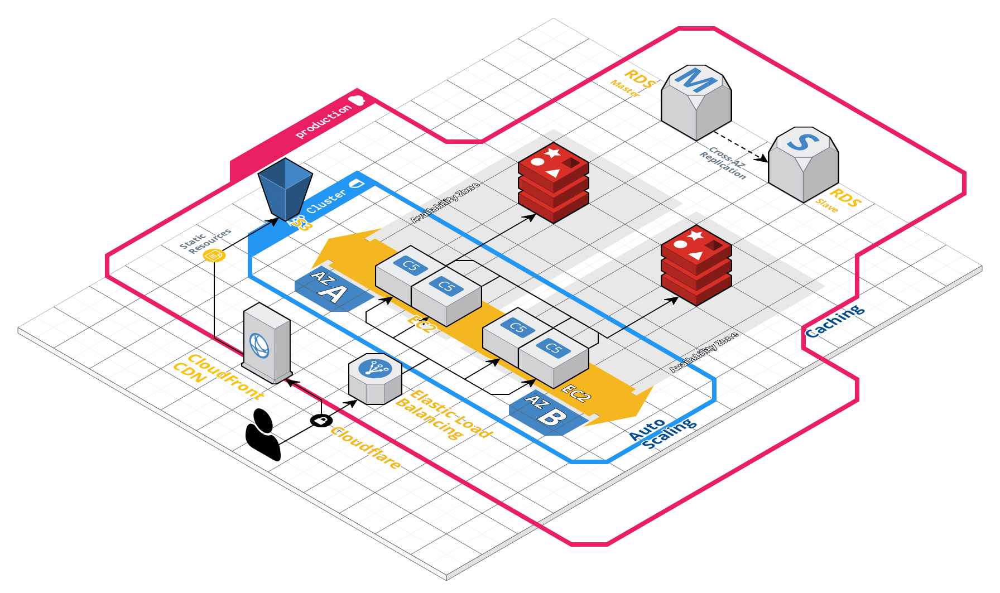

# Architecture

Our reference architecture is distributed by default with resources spread across multiple AWS availability zones. 
This ensures a high level of availability. We also employ several caching techniques to dramatically improve response
times for the end user.

MageCloudKit is built with some of the latest AWS products including Amazon EC2 Container Service, Amazon Aurora
for MySQL and Amazon Elastic File System for sharing media assets. It is easy to integrate third party vendors
including Cloudflare, Bugsnag, Datadog, Algolia and Nosto.

It was designed with the concept of immutability which is a central tenet in the DevOps practice. This concept is
increasingly important as you begin to scale because it becomes unmaintainable to SSH into servers and manually
configure them.

## App Cluster

Our architecture uses Docker to run all of the applications on an App Cluster. An App Cluster is our terminology 
for an [Amazon ECS Cluster][0]. We refer to the individual EC2 instances as 'App Servers'. Customers may wish to
use a single or multiple App Clusters to run their applications. For instance you may wish to run the Magento Admin
Panel on a seperate group of servers.

## Apps

Apps run on an App Cluster and are built according to [12factor][6] principles. An App can be comprised of one or
more Docker containers and is described by an [ECS task definition][7].

Our default App is designed to run Magento and is comprised of the following containers:

 * Nginx Webserver: To serve static assets and reverse proxy requests to the PHP-FPM container.
 * PHP-FPM: To run the Magento application.
 * Blackfire (optional): This container runs the Blackfire agent.

Customers may wish to create further Apps to run applications such as Wordpress.

## Networking & VPC

Each environment launches resources inside an [Amazon VPC][1] (virtual private network). Internally each environment
has both a public and private subnet. This is used for better network isolation and security. We use
[Amazon NAT Gateway][2] to allow the instances in the private subnet to connect to the internet. The NAT gateways
are available in each of the three availability zones.

Our VPC architecture is inspired by a blog post written by Ben Whaley titled "[A Reference VPC architecture][8]".
We deploy three separate subnets for running public facing resources such as load balancers and Bastion instances,
App Servers and then a data persistence subnet for cache and database resources.

## Server Roles

Our architecture utilizes the following server roles and instances:

 * Bastion: The Bastion instance runs in the public subnet and is used to access the resources inside the Amazon
 VPC. Refer to the SSH guide for more information.
 * App Servers: App servers form an ECS cluster and run all of our Docker containers.
 * Jenkins: The Jenkins server role is used to run the [Jenkins][3] automation server software.

The Bastion instance is based on the Ubuntu 16.04 LTS (long-term support release) and the App Servers are based on 
the Amazon Linux 2 AMI. By default all of the instances are hardened and have critical automatic software updates
enabled.

## App Servers

These EC2 instances are part of an App Cluster (ECS cluster) that runs the applications. They run the ECS agent
which is responsible for starting Docker containers when you deploy an application.

Deployments are handled by ECS by creating a new task definition then updating the ECS service to use it. During a
deployment ECS will start the new containers, connect them to the load balancer then wait for them to become
healthy before terminating the old ones.

## Cache

MageCloudKit includes modules for both Memcached & Redis using [Amazon Elasticache][4]. By default we run
two Redis Cache clusters to store the Magento cache and session data.

## Database

MageCloudKit includes a module to run a database using [Amazon Aurora][5]. Amazon Aurora can deliver up to a 5x increase in performance on the same hardware. Amazon Aurora is a drop in replacement for MySQL and supports the same protocol and tools. In addition Aurora uses the concept of clusters for better reliability and performance.

## Service Discovery

We utilize Route53 for a basic form of service discovery. We achieve this by using an internal hosted zone with
common DNS records for the database, cache and EFS filesystem.

Out of the box, MageCloudKit creates the following DNS records:

| Description           | Value                                         |
| --------------------- | --------------------------------------------- |
| Aurora Database       | db.us-east-1.magecloudkit.internal            |
| EFS Filesystem        | media.efs.us-east-1.magecloudkit.internal     |
| Redis Cache Cluster   | redis-cache.us-east-1.magecloudkit.internal   |
| Redis Session Cluster | redis-session.us-east--1.magecloudkit.interal |

## Security

 * Ubuntu Updates

[0]: https://docs.aws.amazon.com/AmazonECS/latest/developerguide/ECS_clusters.html
[1]: https://aws.amazon.com/vpc/
[2]: https://docs.aws.amazon.com/vpc/latest/userguide/vpc-nat-gateway.html
[3]: https://jenkins.io/
[4]: https://aws.amazon.com/elasticache/
[5]: https://aws.amazon.com/rds/aurora/
[6]: https://12factor.net/
[7]: https://docs.aws.amazon.com/AmazonECS/latest/developerguide/task_definitions.html
[8]: https://www.whaletech.co/2014/10/02/reference-vpc-architecture.html
